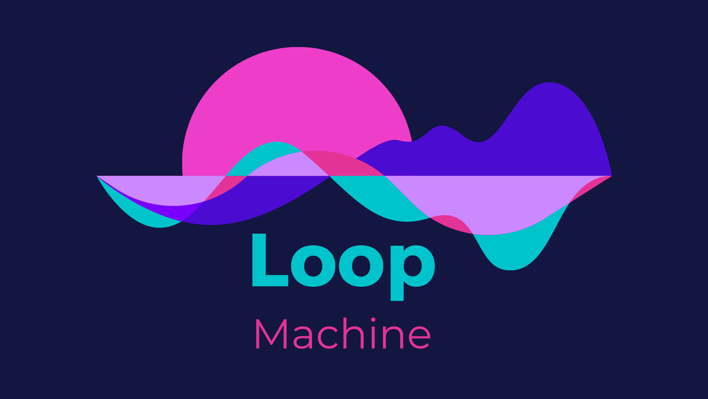
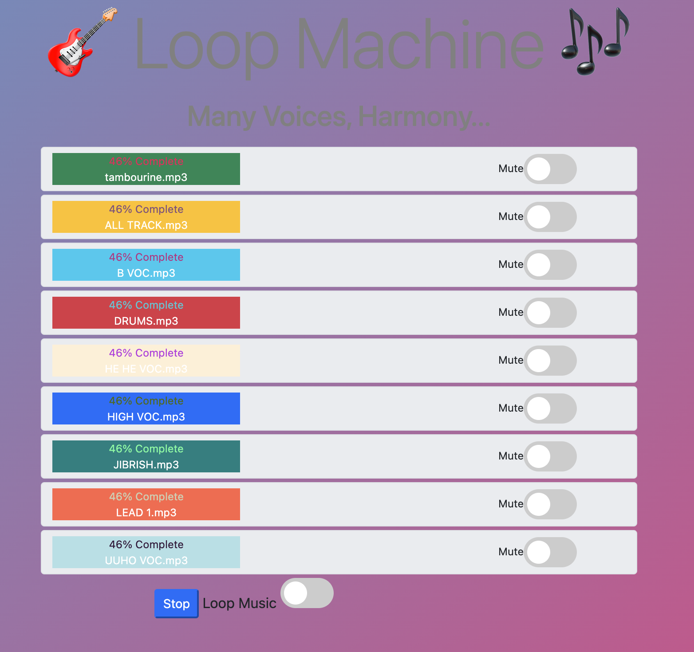
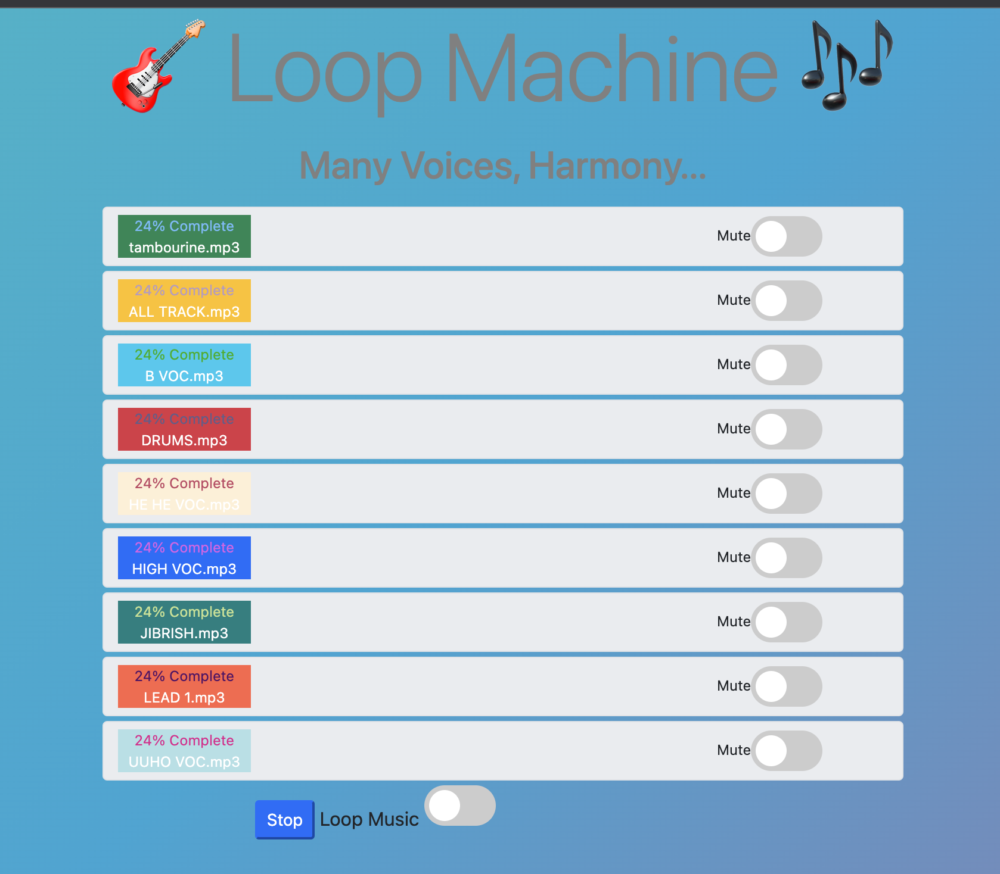

      <h1>  Loop-Machine</h1>
     

# Description

A 9 Track Simultaneous Music Player.
Deployed to Github Pages, check it out: https://gertzman.github.io/Loop-Machine/

# Features

- An individual mute toggle for each track.
- Play and stop buttons to collectively control all 9 tracks.
- A collective mute toggle that when switched on will allow all 9 tracks to endlessly repeat.

# Tech Used

  

